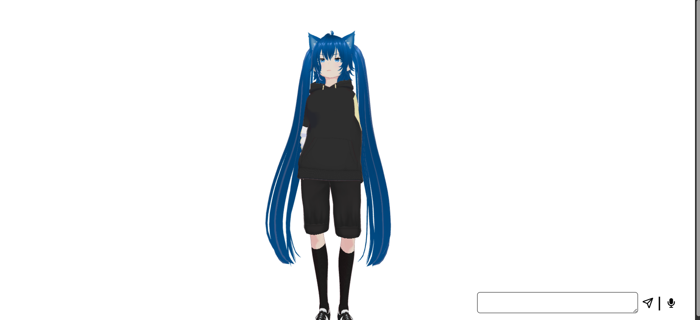

# Anime-like AI Waifu


AI WAIFU BROUGHT TO LIFE VER 0 \
This project runs a lightweight model (qwen3:4b) using ollama and combines openai whisper stt, voicevox tts and pixiv three-vrm in three js to create a lightweight, easy on your pc, your friendly neighborhood ~~spiderman~~ fully locally running ai waifu.

and this is just the beggining...

## Setup guide

Download [whisper tiny cpp model](https://huggingface.co/ggerganov/whisper.cpp/blob/main/ggml-tiny.bin) and [whisper-cpp](https://github.com/ggml-org/whisper.cpp/releases).

Download the [VOICEVOX zip file](https://cevox.hiroshiba.jp).

Clone the project.

```bash
  git clone https://github.com/arnav123098/ai-anime-like-waifu
  cd ai-anime-like-waifu
```

Move the whisper folder and voicevox folder into project root and the whisper tiny model in the whisper-models folder as

```bash
  project/
  whisper/          ← whisper.cpp folder
  whisper-models/   ← put ggml-tiny.bin here
  voicevox/         ← VOICEVOX engine folder
```

Install python dependencies

```bash
  pip install -r requirements.txt
```

Open and configure setup.py file.

Install frontend dependencies

```bash
  cd frontend
  npm install
```

Go to powershell and then to your project directory and run. Frontend runs on port 5173.

```powershell
  ./start.ps1   ← in the project directory
```



## TODO
- [ ]  add lipsync for mouth movements 

